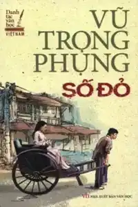
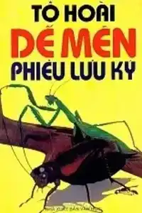
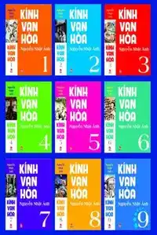
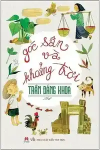
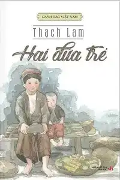
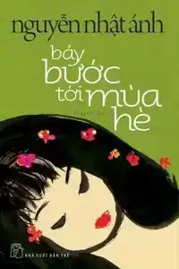
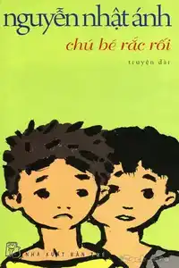

Most of the books here are written by Vietnamese, not the translated one.

| Name | Author | Description | Book cover |
| --- | --- | --- | --- |
| Cho tôi xin một vé về tuổi thơ | Nguyễn Nhật Ánh | | |
| Số đỏ | Vũ Trọng Phung  | |  |
| Dế mèn phiêu lưu kí | Tô Hoài | Tác phẩm dành cho thiếu nhi |  |
| Kính vạn hoa | Nguyễn Nhật Ánh | Tổng hợp 54 tập truyện |  |
| Góc sân và khoảng trời | Trần Đăng Khoa  | |  |
| Hai đứa trẻ | Thạch Lam | |  |
| Bảy bước tới mùa hè | Nguyễn Nhật Ánh | |  |
| Chú bé rắc rối | Nguyễn Nhật Ánh | |  |
|  |                 |                             | |
