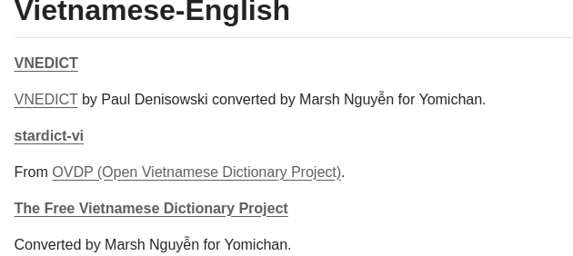
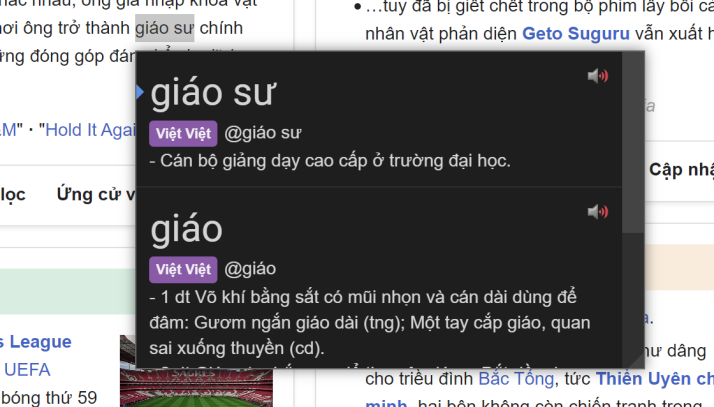

First, please read the guide written by shoui from TheMoeWay [here]() then visit [this page](https://github.com/MarvNC/yomichan-dictionaries?tab=readme-ov-file#vietnamese-english) to download Vietnamese - English Dictionary (VNEDICT) Yomitan dictionary.

Then download the VNEDICT and import it to Yomitan.

Here is the preview for Viet - Viet Dictionary made by Marsh Nguyễn:

